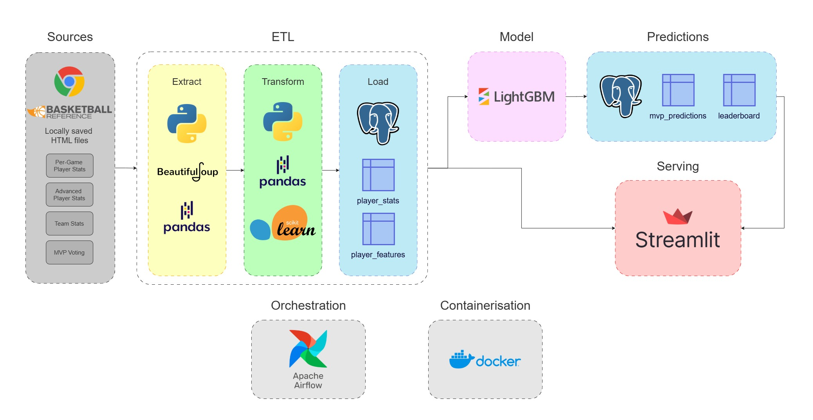

# NBA MVP Prediction Pipeline :basketball:

End-to-end data engineering and machine learning pipeline that predicts the NBA MVP for the current season using historic and current player and team stats. 

The project ingests player and team stats, transforms and loads into **PostgreSQL**, transforming features to train a **LightGBM** model, and serves results via a **Streamlit** dashboard.

The pipeline is orchestrated using **Apache Airflow**, with containerised services using **Docker**. Unit tests are implemented using **pytest**.

You can view the live dashboard here: https://nbamvppredictor.streamlit.app/

## 📑 Table of Contents
- [Project Architecture](#-project-architecture)
- [Tech Stack](#-tech-stack)
- [Airflow DAGs](#-airflow-dags)
- [Machine Learning Model](#-machine-learning-model)
- [Streamlit Dashboard](#-streamlit-dashboard)
- [Running the Project](#-running-the-project)
- [Future Improvements](#-future-improvements)

## 📂 Project Architecture



## 🛠️ Tech Stack

### 🏭 Data Pipeline
- Python (pandas, beautifulsoup)
- Apache Airflow
- PostgreSQL
- Docker

### 🤖 Machine Learning
- scikit-learn
- LightGBM

### 📊 Dashboard
- Streamlit

### 📐 Testing
- pytest

## 🔄 Airflow DAGs
The pipeline consists of three workflows:
### Historic ETL
1. Extract historic data from local HTML files
2. Clean and transform data into single player-season rows
3. Load data into PostgreSQL database

### Model Training
1. Query database for historic stats
2. Add model feature columns
3. Fit MVP prediction model
4. Save model locally

### Prediction
1. Perform ETL on current season data
2. Feed data into MVP prediction model
3. Load predictions into database
4. Log data freshness of player stats

## 🤖 Machine Learning Model

The model predicts a player's vote share (points won / max points allowed) using historic mvp voting data and player/team performance.

### 🧪 Experimentation
Please view notebooks for detailed exploratory data analysis and experimentation.

Player stats are scaled using **scikit-learn.StandardScaler** split by season, to capture how a player performed against MVP competition and eliminate season trends (e.g. Players score more points on average past the 2017/18 season).

A prediction set of all zeroes was used as a baseline, as only 2% of players recieve any vote share in a given season. Data from the 2024/25 season was used as testing data. Mean Average Error and r2 score were used for evaluation.

### 🛑 Key Issues
- Vote Share is heavily skewed, the vast majority of players do not recieve votes
- Outliers exist for advanced stats, players who played few minutes and overperformed have unrealistic PER and BPM stats
- Models consistently overpredicted players who intuitively had no chance at receiving votes
- Some models predicted vote share over 1, which is not seen in training data

### 📋 Testing Results

| Model | MAE | r2 Score |
|-------|-----|----------|
| Baseline | 0.0056 | N/A |
| Hybrid Linear + Logistic Regression | 0.0056 | 0.2698 |
| Random Forest Regressor | 0.0024 | 0.9336 |
| XGBoost | 0.0015 | 0.9434 |
| LightGBM | 0.0020 | 0.9688 |
| Neural Network | 0.0029 | 0.9087 |

### 🏆 Model Selection

**LightGBM** was chosen as the final model for deployment.

Although **XGBoost** achieved the lowest MAE, **LightGBM** produced the highest r2 score, indicating it explains the variance in MVP vote share better. Model training time is of limited importance to this problem as training would only take place once a year - after MVP voting has concluded.

**LightGBM** also handled the key issues well, handling outliers and predicting vote share of below 1.

The final model uses a hybrid approach of a **LightGBM** classifier to predict whether a player would recieve votes and a **LightGBM** regressor to predict vote share. Adding a classifier to this model helps eliminate models overpredicting players with zero vote share.

### 📄 Key Takeaways

- Gradient boosting models outperform linear models and neural networks for tabular data  
- Feature interactions are critical in predicting MVP vote share  
- **LightGBM** provides the strongest performance in terms of explanatory power for this problem

## 📊 Streamlit Dashboard
The dashboard provides a clean presentation of model predictions: https://nbamvppredictor.streamlit.app/

Features include:
- Current MVP favourite
- Vote Share predictions
- Player headshots
- Season statistics
- Data freshness

## ⚙️ Running the Project

Clone the repository:

```bash
git clone https://github.com/esencela/NBA_MVP_Predictor
```

Start the environment:

```bash
docker compose up -d
```

Access the services:
- Airflow UI: http://localhost:8080
- Streamlit Dashboard: http://localhost:8501

## 🔼 Future Improvements

Potential enhancements could include:
- Additional features (FG%, Average Team points, defensive metrics)
- Cloud deployment
- CI/CD pipeline
- MLOps (model monitoring, MLFlow)

